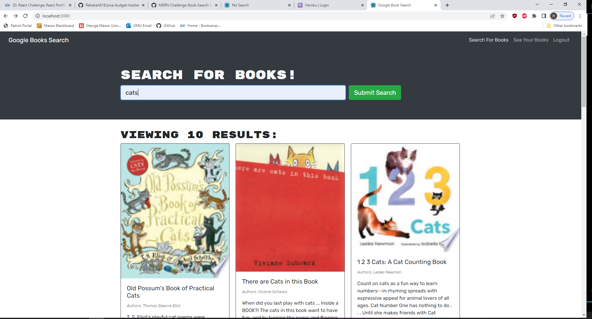

# online-book-hunt

# Description
The online book hunt is your one stop shop for searching and saving all of your favorite books! 

# Github 
https://github.com/Rebekah818/online-book-hunt
# Installation
npm i node, express, apollo-server-express, apollo-client, mongoose, mongodb, REACT 
# Usage
This project is used for searching and saving books using the google books api
# Contributors 
Rebekah818

# screenshots

# Table of Contents
Project Name, Description, Github, Installation, Usage, Contributors, Screenshots, Table of Contents
